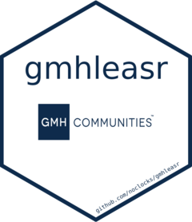

# GMH Leasing Package - `gmhleasr` 

> [!NOTE] 
> This is an R oackage for GMH Leasing. It is a work in progress.

<!-- badges: start -->

[](https://github.com/noclocks/gmhleasr/actions/workflows/roxygen.yml)
[](https://github.com/noclocks/gmhleasr/actions/workflows/lint.yml)
[](https://github.com/noclocks/gmhleasr/actions/workflows/pull-requests.yml)
[](https://github.com/noclocks/gmhleasr/actions/workflows/style.yml)
[](https://github.com/noclocks/gmhleasr/actions/workflows/coverage.yml)
[](https://github.com/noclocks/gmhleasr/actions/workflows/check.yml)
[](https://codecov.io/gh/noclocks/gmhleasr)
<!-- badges: end -->

## Contents {#contents}

-   [Contents](#contents)
-   [Overview](#overview)
-   [Installation](#installation)
-   [Example](#example)

## Overview {#overview}

The goal of gmhleasr is to ...

## Installation {#installation}

You can install the development version of gmhleasr like so:

``` r
# FILL THIS IN! HOW CAN PEOPLE INSTALL YOUR DEV PACKAGE?
```

## Example {#example}

This is a basic example which shows you how to solve a common problem:

``` r
library(gmhleasr)
## basic example code
```
